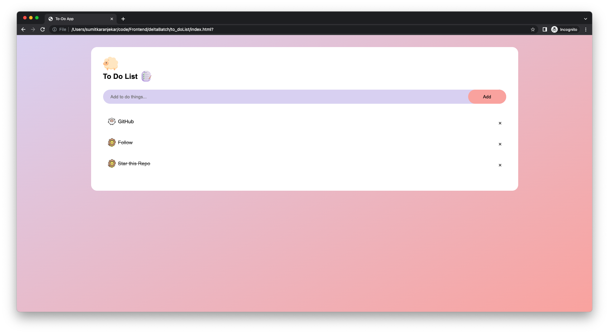

# This is To Do List project made by Sumit Karanjekar
It helps to Organize Task and store Task Data in local storage.

It Consist of some cool checked and unchecked task image/symbol which is funny to see.
Note- You can change fancy theme into naruto shirigami with changing image in html and color of background


<br>

# Installation

<h3>Run this repo on your PC
   Copy and Paste following syntax in your terminal:</h3>


```bash
git clone https://github.com/thisSumit/To-Do_List
```


```bash
cd To-Do_List
```


```bash
open index.html
```

Do check it out and Follow Me


# Created with-
Language- Javascript
Tool- HTML & CSS 
